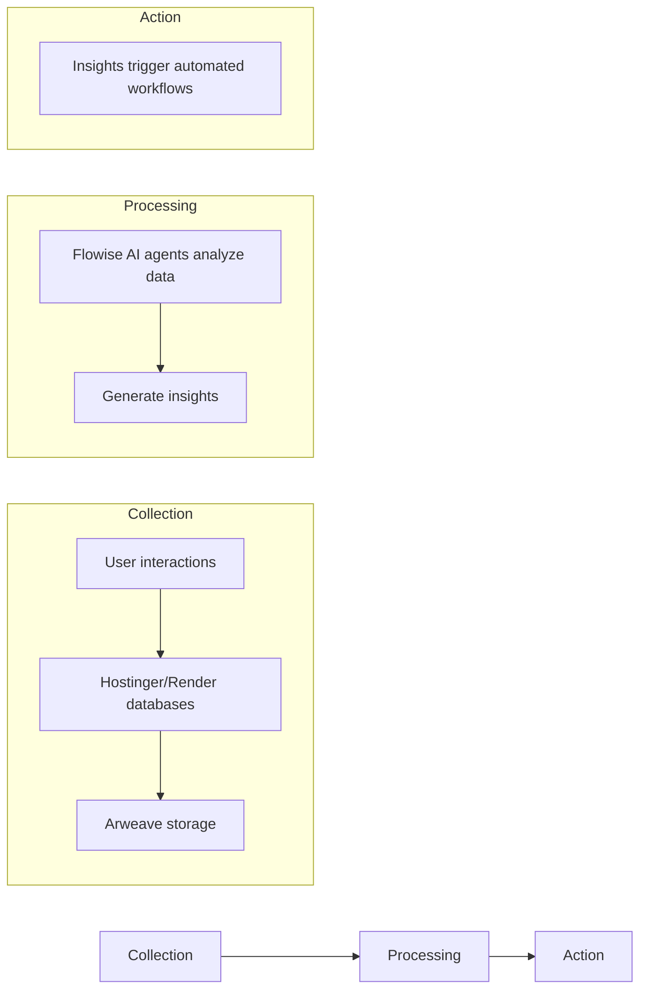

# **TechnoPlay LLC**

  

# **Business Intelligence & Automation Solutions (BIAS Division)**

*Building Intelligence, Automating Success*

---

## **Division Overview**

|   |   |
|:--|:--|
| **Name** | **BIAS** (Business Intelligence & Automation Solutions) |
| **Mission** | Democratize access to AI-driven business intelligence and no-code automation tools, enabling businesses to transform data into actionable insights and scalable workflows through decentralized technologies. |
| **Vision** | Become the leading provider of modular, user-controlled AI ecosystems that integrate seamlessly with existing infrastructure while driving data monetization and operational efficiency. |

  
### **Core Value Proposition**
> *"From modular websites to AI-powered data hubs: Grow your business with tools that learn as you scale."*

---

## **Business Model Canvas**

<table>
  <tr>
    <th width="25%" align="center">🎯   <b>Customer Segments</b></th>
    <td>
      • SMEs  
      • Tech startups  
      • Decentralized app developers  
      • Enterprises needing BI
    </td>
  </tr>
  <tr>
    <th align="center">💎   <b>Value Propositions</b></th>
    <td>
      • Modular web/app development  
      • No-code AI workflows (Flowise)  
      • Decentralized data storage (Arweave)  
      • Tokenized data monetization
    </td>
  </tr>
  <tr>
    <th align="center">💰   <b>Revenue Streams</b></th>
    <td>
      • Tiered SaaS subscriptions (Basic, Pro, Enterprise)  
      • Custom workflow development fees  
      • Data marketplace commissions  
      • Token transaction fees
    </td>
  </tr>
  <tr>
    <th align="center">📣   <b>Channels</b></th>
    <td>
      • Hostinger/Render-based website builder  
      • CryptoPlaza integration  
      • Partner networks (Arweave, Flowise)
    </td>
  </tr>
  <tr>
    <th align="center">🔑   <b>Key Resources</b></th>
    <td>
      • Modular tech stack (Hostinger, Render, Flowise)  
      • AI/blockchain developers  
      • Arweave's permaweb infrastructure
    </td>
  </tr>
  <tr>
    <th align="center">💵   <b>Cost Structure</b></th>
    <td>
      • Platform licensing (Hostinger, Flowise)  
      • Cloud/server costs (Render)  
      • R&D for AI integration
    </td>
  </tr>
  <tr>
    <th align="center">🤝   <b>Partnerships</b></th>
    <td>
      • Hostinger  
      • Render  
      • Flowise  
      • Arweave  
      • JSMastery (landing page templates)
    </td>
  </tr>
</table>

---

## **Workflow Implementation Phases**

  

### **Phase 1: Modular Web/App Development** 🏗️

<table>
  <tr>
    <th width="20%" align="center"><b>Tools</b></th>
    <td>Hostinger Website Builder + Render (App Server)</td>
  </tr>
</table>

#### **Process:**

  

    <h4>1️⃣ Client Onboarding</h4>
    <ul>
      <li>Clients submit requirements via a Protune Hub-style template (e.g., scalable structure, future features)</li>
      <li>AI-generated Product Requirement Document (PRD) using corporate brand guidelines</li>
    </ul>
  

  
  

    <h4>2️⃣ Development</h4>
    <ul>
      <li>Build MVP website/app with:
        <ul>
          <li>Core pages (Home, Services, Contact)</li>
          <li>Embedded analytics (Google Analytics)</li>
          <li>API-ready architecture for future integrations</li>
        </ul>
      </li>
    </ul>
  

  
  

    <h4>3️⃣ Delivery</h4>
    <ul>
      <li>Host on Hostinger (frontend) + Render (backend/database)</li>
    </ul>
  

### **Phase 2: No-Code Automation Integration** ⚙️

<table>
  <tr>
    <th width="20%" align="center"><b>Tools</b></th>
    <td>Flowise + Arweave</td>
  </tr>
</table>

#### **Process:**

  

    <h4>1️⃣ AI Workflow Setup</h4>
    <ul>
      <li>Deploy Flowise instances for clients to create custom AI agents (e.g., marketing chatbots, CRM automations)</li>
    </ul>
  

  
  

    <h4>2️⃣ Decentralized Data Storage</h4>
    <ul>
      <li>Connect client databases to Arweave for immutable storage</li>
      <li>Implement vector stores for LLM-driven insights (e.g., customer behavior analysis)</li>
    </ul>
  

  
  

    <h4>3️⃣ Monetization</h4>
    <ul>
      <li>Freemium model: Basic workflows free; premium tiers unlock advanced AI/analytics</li>
    </ul>
  

### **Phase 3: Ecosystem Scaling** 🚀

<table>
  <tr>
    <th width="20%" align="center"><b>Tools</b></th>
    <td>Tokenomics + Marketplace</td>
  </tr>
</table>

#### **Process:**

  

    <h4>1️⃣ Data Monetization</h4>
    <ul>
      <li>Clients opt into sharing anonymized data for token rewards (TechnoPlay tokens)</li>
    </ul>
  

  
  

    <h4>2️⃣ Marketplace Launch</h4>
    <ul>
      <li>Sell pre-built Flowise workflows (e.g., "SEO Optimizer," "Inventory Manager")</li>
    </ul>
  

  
  

    <h4>3️⃣ Cross-Division Synergy</h4>
    <ul>
      <li>Integrate with CryptoPlaza (DeFi features) and Hardware Division (IoT data processing)</li>
    </ul>
  

---

## **Business Intelligence Approach**

### **Data Flow Architecture:**

### **Key Features:**

  

    <h4>🔮 Predictive Analytics</h4>
    
LLMs forecast trends using historical data

  

  
  

    <h4>🔐 Decentralized Governance</h4>
    
Clients control data access via Arweave smart contracts

  

  
  

    <h4>📊 Real-Time Dashboards</h4>
    
Track KPIs like conversion rates, workflow efficiency

  

---

## **Technical Architecture**

  

  

    <h3>1️⃣ Frontend</h3>
    
Hostinger (modular websites) + JSMastery landing pages

  

  
  

    <h3>2️⃣ Backend</h3>
    
Render (Node.js/Python servers) + PostgreSQL

  

  
  

    <h3>3️⃣ AI Layer</h3>
    
Flowise (workflows) + OpenAI/Hugging Face models

  

  
  

    <h3>4️⃣ Storage</h3>
    
Arweave (immutable data) + AO Computer (vector queries)

  

---

## **Marketing & Brand Persona**

  

    <h3>Brand Voice</h3>
    
"Empathetic Innovator" – Approachable yet authoritative

  

  
  

    <h3>Messaging</h3>
    <blockquote>
      
<em>"Turn data into growth – no PhD required."</em>

    </blockquote>
    <blockquote>
      
<em>"Build now, scale forever."</em>

    </blockquote>
  

### **Launch Strategy:**

  

    <h4>1️⃣ Targeted Campaigns</h4>
    
Webinars on AI automation for SMEs

  

  
  

    <h4>2️⃣ Partnership Collabs</h4>
    
Co-host hackathons with Flowise/Arweave

  

  
  

    <h4>3️⃣ Content Marketing</h4>
    
Case studies (e.g., Protune Hub success story)

  

---

## **Risk Management**

<table>
  <tr>
    <th width="33%" align="center">⚠️ Technical Risks</th>
    <th width="33%" align="center">🔒 Data Security</th>
    <th width="33%" align="center">🚧 Adoption Barriers</th>
  </tr>
  <tr>
    <td>Mitigate API compatibility issues with sandbox testing</td>
    <td>Arweave encryption + GDPR compliance</td>
    <td>Offer free onboarding workshops for no-code tools</td>
  </tr>
</table>

---

## **Financial Projections**

  

    <h3>Year 1</h3>
    
Focus on user acquisition (1,000+ clients)

    

      

    

  

  
  

    <h3>Year 2</h3>
    
Monetize via premium subscriptions ($30–$300/month)

    

      

    

  

  
  

    <h3>Year 3</h3>
    
Expand marketplace/data tokenization (20% revenue share)

    

      

    

  

---

## **Appendices**

  

    <h4>📊 Full Pain Points-Desires-Solutions Matrix</h4>
    
(50+ items)

  

  
  

    <h4>⚙️ Flowise vs. n8n Technical Comparison</h4>
    
Detailed analysis of automation platforms

  

  
  

    <h4>📝 Protune Hub PRD Template</h4>
    
Standardized document framework

  

---

  
# *TechnoPlay BIAS Division – Building Intelligence, Automating Success.*

