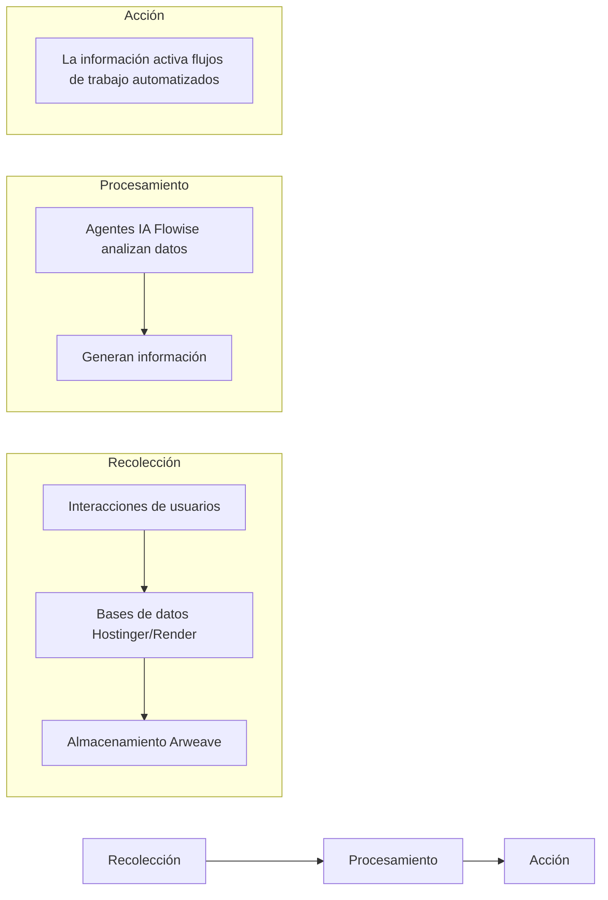

# **TechnoPlay LLC**

  

# **División de Soluciones de Inteligencia de Negocios y Automatización (BIAS)**

*Construyendo Inteligencia, Automatizando el Éxito*

---

## **Visión General de la División**

|   |   |
|:--|:--|
| **Nombre** | **BIAS** (Soluciones de Inteligencia de Negocios y Automatización) |
| **Misión** | Democratizar el acceso a herramientas de inteligencia de negocios impulsadas por IA y automatización sin código, permitiendo a las empresas transformar datos en conocimientos accionables y flujos de trabajo escalables a través de tecnologías descentralizadas. |
| **Visión** | Convertirse en el proveedor líder de ecosistemas de IA modulares controlados por el usuario que se integran perfectamente con la infraestructura existente mientras impulsan la monetización de datos y la eficiencia operativa. |

  
### **Propuesta de Valor Principal**
> *"De sitios web modulares a centros de datos impulsados por IA: Haz crecer tu negocio con herramientas que aprenden mientras escalas."*

---

## **Lienzo de Modelo de Negocio**

<table>
  <tr>
    <th width="25%" align="center">🎯   <b>Segmentos de Clientes</b></th>
    <td>
      • PYMES  
      • Startups tecnológicas  
      • Desarrolladores de aplicaciones descentralizadas  
      • Empresas que necesitan BI
    </td>
  </tr>
  <tr>
    <th align="center">💎   <b>Propuestas de Valor</b></th>
    <td>
      • Desarrollo modular de web/aplicaciones  
      • Flujos de trabajo de IA sin código (Flowise)  
      • Almacenamiento de datos descentralizado (Arweave)  
      • Monetización de datos tokenizados
    </td>
  </tr>
  <tr>
    <th align="center">💰   <b>Fuentes de Ingresos</b></th>
    <td>
      • Suscripciones SaaS escalonadas (Básica, Pro, Empresarial)  
      • Tarifas por desarrollo de flujos de trabajo personalizados  
      • Comisiones del mercado de datos  
      • Tarifas por transacciones de tokens
    </td>
  </tr>
  <tr>
    <th align="center">📣   <b>Canales</b></th>
    <td>
      • Constructor de sitios web basado en Hostinger/Render  
      • Integración con CryptoPlaza  
      • Redes de socios (Arweave, Flowise)
    </td>
  </tr>
  <tr>
    <th align="center">🔑   <b>Recursos Clave</b></th>
    <td>
      • Stack tecnológico modular (Hostinger, Render, Flowise)  
      • Desarrolladores de IA/blockchain  
      • Infraestructura permaweb de Arweave
    </td>
  </tr>
  <tr>
    <th align="center">💵   <b>Estructura de Costos</b></th>
    <td>
      • Licencias de plataforma (Hostinger, Flowise)  
      • Costos de nube/servidor (Render)  
      • I+D para integración de IA
    </td>
  </tr>
  <tr>
    <th align="center">🤝   <b>Alianzas</b></th>
    <td>
      • Hostinger  
      • Render  
      • Flowise  
      • Arweave  
      • JSMastery (plantillas de landing pages)
    </td>
  </tr>
</table>

---

## **Fases de Implementación del Flujo de Trabajo**

  

### **Fase 1: Desarrollo Modular de Web/Aplicaciones** 🏗️

<table>
  <tr>
    <th width="20%" align="center"><b>Herramientas</b></th>
    <td>Constructor de Sitios Web Hostinger + Render (Servidor de Aplicaciones)</td>
  </tr>
</table>

#### **Proceso:**

  

    <h4>1️⃣ Incorporación de Clientes</h4>
    <ul>
      <li>Los clientes envían requisitos a través de una plantilla estilo Protune Hub (ej., estructura escalable, características futuras)</li>
      <li>Documento de Requisitos del Producto (PRD) generado por IA utilizando directrices de marca corporativa</li>
    </ul>
  

  
  

    <h4>2️⃣ Desarrollo</h4>
    <ul>
      <li>Construcción de MVP de sitio web/aplicación con:
        <ul>
          <li>Páginas principales (Inicio, Servicios, Contacto)</li>
          <li>Analíticas integradas (Google Analytics)</li>
          <li>Arquitectura preparada para API para integraciones futuras</li>
        </ul>
      </li>
    </ul>
  

  
  

    <h4>3️⃣ Entrega</h4>
    <ul>
      <li>Alojamiento en Hostinger (frontend) + Render (backend/base de datos)</li>
    </ul>
  

### **Fase 2: Integración de Automatización Sin Código** ⚙️

<table>
  <tr>
    <th width="20%" align="center"><b>Herramientas</b></th>
    <td>Flowise + Arweave</td>
  </tr>
</table>

#### **Proceso:**

  

    <h4>1️⃣ Configuración de Flujos de Trabajo de IA</h4>
    <ul>
      <li>Implementación de instancias Flowise para que los clientes creen agentes de IA personalizados (ej., chatbots de marketing, automatizaciones de CRM)</li>
    </ul>
  

  
  

    <h4>2️⃣ Almacenamiento de Datos Descentralizado</h4>
    <ul>
      <li>Conexión de bases de datos de clientes a Arweave para almacenamiento inmutable</li>
      <li>Implementación de almacenes vectoriales para información basada en LLM (ej., análisis de comportamiento del cliente)</li>
    </ul>
  

  
  

    <h4>3️⃣ Monetización</h4>
    <ul>
      <li>Modelo freemium: Flujos de trabajo básicos gratuitos; niveles premium desbloquean IA/analíticas avanzadas</li>
    </ul>
  

### **Fase 3: Escalado del Ecosistema** 🚀

<table>
  <tr>
    <th width="20%" align="center"><b>Herramientas</b></th>
    <td>Tokenomics + Marketplace</td>
  </tr>
</table>

#### **Proceso:**

  

    <h4>1️⃣ Monetización de Datos</h4>
    <ul>
      <li>Los clientes optan por compartir datos anonimizados a cambio de recompensas en tokens (tokens TechnoPlay)</li>
    </ul>
  

  
  

    <h4>2️⃣ Lanzamiento del Marketplace</h4>
    <ul>
      <li>Venta de flujos de trabajo Flowise preconfigurados (ej., "Optimizador SEO", "Gestor de Inventario")</li>
    </ul>
  

  
  

    <h4>3️⃣ Sinergia Entre Divisiones</h4>
    <ul>
      <li>Integración con CryptoPlaza (características DeFi) y División de Hardware (procesamiento de datos IoT)</li>
    </ul>
  

---

## **Enfoque de Inteligencia de Negocios**

### **Arquitectura de Flujo de Datos:**

### **Características Principales:**

  

    <h4>🔮 Análisis Predictivo</h4>
    
Los LLMs pronostican tendencias utilizando datos históricos

  

  
  

    <h4>🔐 Gobernanza Descentralizada</h4>
    
Los clientes controlan el acceso a datos mediante contratos inteligentes Arweave

  

  
  

    <h4>📊 Paneles en Tiempo Real</h4>
    
Seguimiento de KPIs como tasas de conversión, eficiencia de flujos de trabajo

  

---

## **Arquitectura Técnica**

  

  

    <h3>1️⃣ Frontend</h3>
    
Hostinger (sitios web modulares) + landing pages JSMastery

  

  
  

    <h3>2️⃣ Backend</h3>
    
Render (servidores Node.js/Python) + PostgreSQL

  

  
  

    <h3>3️⃣ Capa de IA</h3>
    
Flowise (flujos de trabajo) + modelos OpenAI/Hugging Face

  

  
  

    <h3>4️⃣ Almacenamiento</h3>
    
Arweave (datos inmutables) + AO Computer (consultas vectoriales)

  

---

## **Marketing y Personalidad de Marca**

  

    <h3>Voz de Marca</h3>
    
"Innovador Empático" – Accesible pero con autoridad

  

  
  

    <h3>Mensajes</h3>
    <blockquote>
      
<em>"Convierte datos en crecimiento – sin necesidad de un doctorado."</em>

    </blockquote>
    <blockquote>
      
<em>"Construye ahora, escala para siempre."</em>

    </blockquote>
  

### **Estrategia de Lanzamiento:**

  

    <h4>1️⃣ Campañas Dirigidas</h4>
    
Webinars sobre automatización con IA para PYMES

  

  
  

    <h4>2️⃣ Colaboraciones con Socios</h4>
    
Co-organización de hackathons con Flowise/Arweave

  

  
  

    <h4>3️⃣ Marketing de Contenidos</h4>
    
Casos de estudio (ej., historia de éxito de Protune Hub)

  

---

## **Gestión de Riesgos**

<table>
  <tr>
    <th width="33%" align="center">⚠️ Riesgos Técnicos</th>
    <th width="33%" align="center">🔒 Seguridad de Datos</th>
    <th width="33%" align="center">🚧 Barreras de Adopción</th>
  </tr>
  <tr>
    <td>Mitigación de problemas de compatibilidad de API con pruebas en sandbox</td>
    <td>Encriptación Arweave + cumplimiento GDPR</td>
    <td>Oferta de talleres gratuitos de iniciación para herramientas sin código</td>
  </tr>
</table>

---

## **Proyecciones Financieras**

  

    <h3>Año 1</h3>
    
Enfoque en adquisición de usuarios (más de 1,000 clientes)

    

      

    

  

  
  

    <h3>Año 2</h3>
    
Monetización mediante suscripciones premium ($30–$300/mes)

    

      

    

  

  
  

    <h3>Año 3</h3>
    
Expansión del marketplace/tokenización de datos (20% de participación en ingresos)

    

      

    

  

---

## **Apéndices**

  

    <h4>📊 Matriz Completa de Puntos de Dolor-Deseos-Soluciones</h4>
    
(Más de 50 elementos)

  

  
  

    <h4>⚙️ Comparación Técnica Flowise vs. n8n</h4>
    
Análisis detallado de plataformas de automatización

  

  
  

    <h4>📝 Plantilla PRD de Protune Hub</h4>
    
Marco estandarizado de documentos

  

---

  
# *División BIAS de TechnoPlay – Construyendo Inteligencia, Automatizando el Éxito.*

